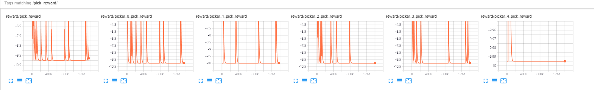
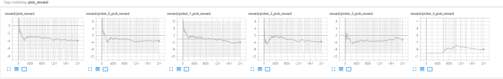
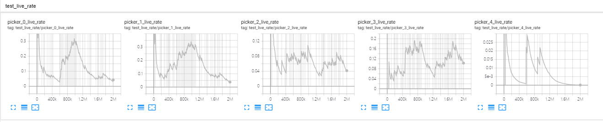

# Game of Pick Beans
## Env Settings
1. There are N beans and M players.
2. The M players pick the beans in order, they can know the number of the left beans before they pick.
3. After each player has picked his beans, we will compute the result:
   1. All the players with the most and least beans will die, receiving a death reward (e.g., -10).
      1. An additional settings: the dead players can get a conciliatory reward (e.g., 5).
   2. Other players will live and receives a live reward (e.g., 10).

## Result
1. dead reward = -10, alive reward = 10, other dead reward = 5, M = 5, N = 50.
   1. Final selecting beans: 8,8,7,8,8 or 50,0,0,0,0 with every player dies.
   2. The player finds that it is hard for them to live and so they begin to optimize to make the others to die to get the other dead reward.
   3. The following image shows the dead and live reward every player receives (i.e., other dead reward excluded in this image )
   
   4. Conclusion: if others' death will give the player additional reward when the player itself dies, there will be definitely no one alive.
2. dead reward = -10, alive reward = 10, other dead reward = 0, M = 5, N = 50.
   1. Final selecting beans: 9,9,9,8,9 with every player dies.
   2. The following image shows the dead and live reward every player receives (i.e., other dead reward excluded in this exp )
   
   3. The reward is not as obvious as in No.1 exps, so we compute the live rate of each player in this time (in **TEST** mode: select actions with argmax instead of sampling):
   
   4. Conclusion: everyone will die in most time, and it seems that the 1st and 2nd players' live rates are a little higher and the live rate of the last player is the smallest.